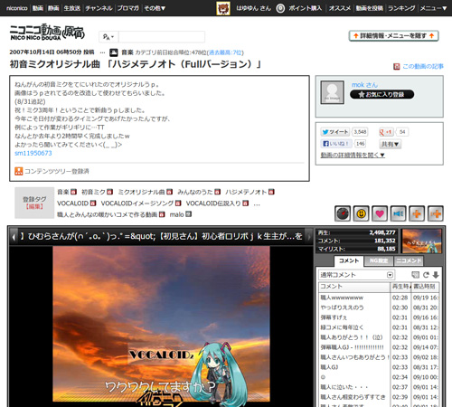

# ニコニコ動画:GINZA を原宿っぽくしてみる

Stylish : <http://userstyles.org/styles/93335/ginza>  
Article : <http://kenapnet.blog.fc2.com/blog-entry-74.html>

## 対応ブラウザ
- GoogleChrome
- Firefox (原宿風は非推奨)
- Opera
- Safari

## ライセンス

この作品は、クリエイティブ・コモンズ [表示 - 継承 2.1 日本](http://creativecommons.org/licenses/by-sa/2.1/jp/) ライセンスの下に提供されています。

## 免責事項
この UserStyleSheet をインストール、二次的利用をしたことによる、何らかのトラブルや損失・損害等につきまして [nanoway](http://nanoway.hateblo.jp) は、一切の責任を問わないものとします。
